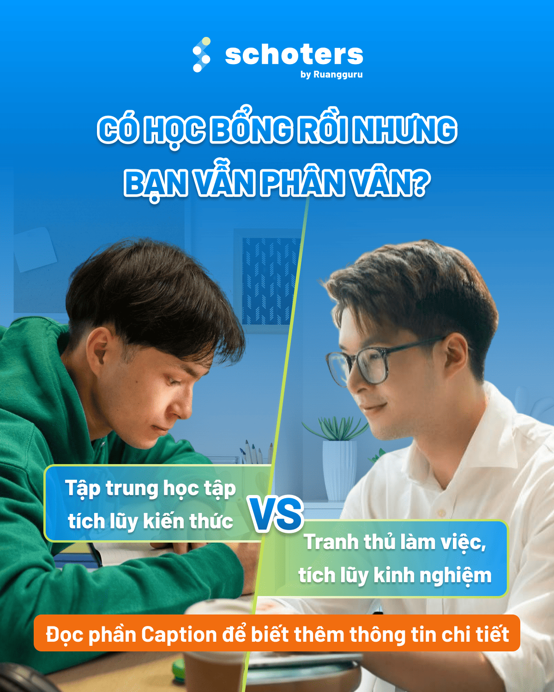
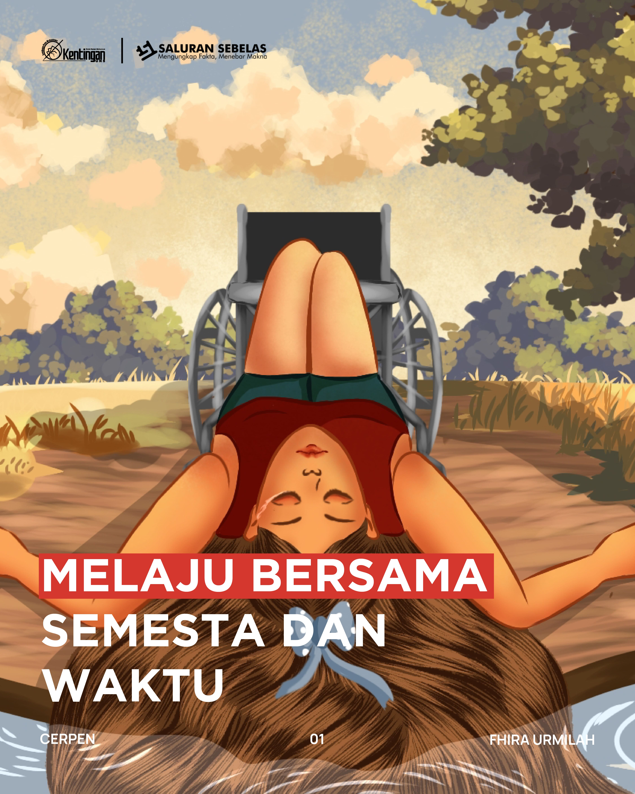
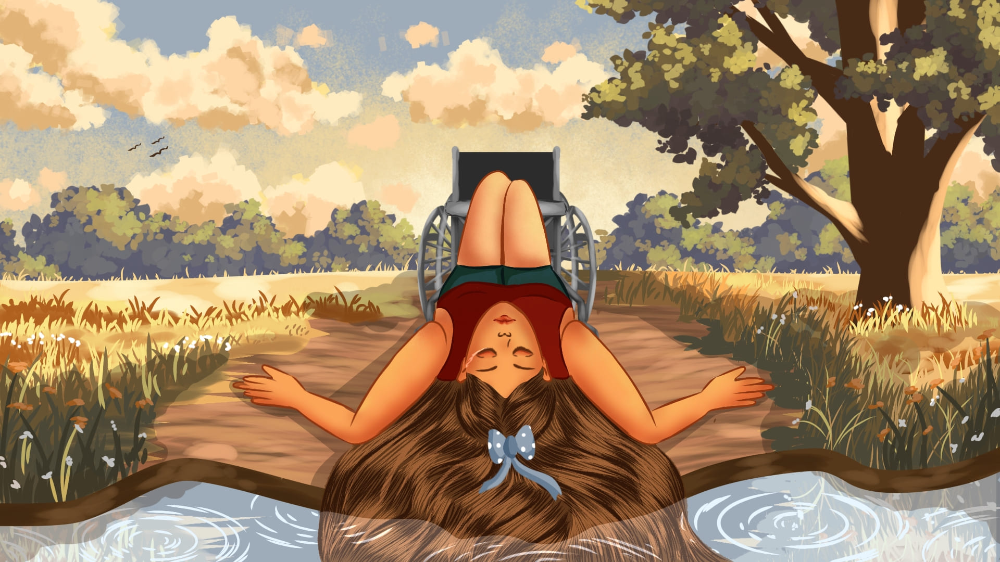
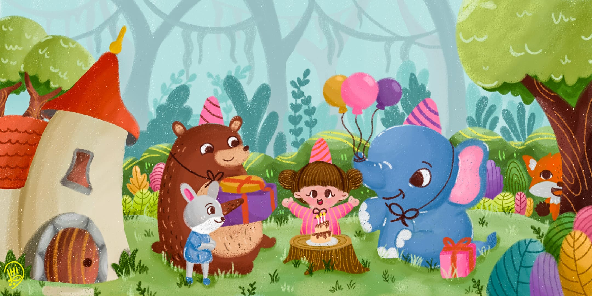
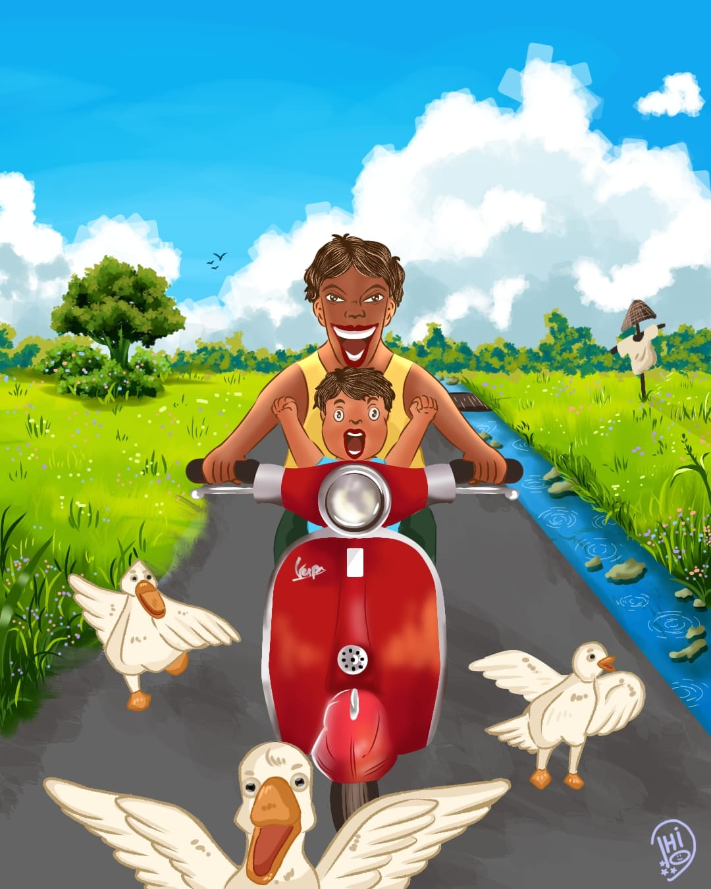

<!DOCTYPE html>
<html lang="en-US">
  <head>
    <meta charset="UTF-8">
    <meta http-equiv="X-UA-Compatible" content="IE=edge">
    <meta name="viewport" content="width=device-width, initial-scale=1">
    <title>Rifki's CV</title>
    <link href="https://fonts.googleapis.com/css?family=Montserrat:400,700,200" rel="stylesheet">
    <link href="https://maxcdn.bootstrapcdn.com/font-awesome/latest/css/font-awesome.min.css" rel="stylesheet">
    <link href="css/aos.css?ver=1.1.0" rel="stylesheet">
    <link href="css/bootstrap.min.css?ver=1.1.0" rel="stylesheet">
    <link href="css/main.css?ver=1.1.0" rel="stylesheet">
    <noscript>
      
    </noscript>
  </head>
  <body id="top">
    <header>
      

        <nav class="navbar navbar-expand-lg fixed-top navbar-transparent bg-primary" color-on-scroll="400">
          

            
<a class="navbar-brand" href="#" rel="tooltip">Rifki's CV</a>
              <button class="navbar-toggler navbar-toggler" type="button" data-toggle="collapse" data-target="#navigation" aria-controls="navigation" aria-expanded="false" aria-label="Toggle navigation"></button>
            

            

              <ul class="navbar-nav">
                <li class="nav-item"><a class="nav-link smooth-scroll" href="#about">About</a></li>
                <li class="nav-item"><a class="nav-link smooth-scroll" href="#skill">Skills</a></li>
                <li class="nav-item"><a class="nav-link smooth-scroll" href="#portfolio">Portfolio</a></li>
                <li class="nav-item"><a class="nav-link smooth-scroll" href="#experience">Experience</a></li>
                <li class="nav-item"><a class="nav-link smooth-scroll" href="#contact">Contact</a></li>
              </ul>
            

          

        </nav>
      

    </header>
    

      

  

    

      

      

        

          

          
Rifki Dhio Saputra

          
Graphic Designer,  Illustrator
<a class="btn btn-primary smooth-scroll mr-2" href="#contact" data-aos="zoom-in" data-aos-anchor="data-aos-anchor">Hire Me</a><a class="btn btn-primary" href="#" data-aos="zoom-in" data-aos-anchor="data-aos-anchor">Download CV</a>
        

      

      

        

          
<a class="btn btn-default btn-round btn-lg btn-icon" href="#" rel="tooltip" title="Follow me on Facebook"><i class="fa fa-facebook"></i></a><a class="btn btn-default btn-round btn-lg btn-icon" href="#" rel="tooltip" title="Follow me on Twitter"><i class="fa fa-twitter"></i></a><a class="btn btn-default btn-round btn-lg btn-icon" href="#" rel="tooltip" title="Follow me on Google+"><i class="fa fa-google-plus"></i></a><a class="btn btn-default btn-round btn-lg btn-icon" href="#" rel="tooltip" title="Follow me on Instagram"><i class="fa fa-instagram"></i></a>

        

      

    

  

  

    

      

        

          

            
About

            
Hello! I am Rifki Dhio Saputra. Graphic Designer and Illustrator.

            
A Third-year Communication Visual Design Student at Sebelas Maret University. Experience as graphic designer and illustrator at some organisations. Succeed in handling several project based on my strong interest at design, illustration, creative media, visual branding, and layouting. 

          

        

        

          

            
Basic Information

            

              
<strong class="text-uppercase">Age:</strong>

              
21

            

            

              
<strong class="text-uppercase">Email:</strong>

              
rifkirds1500404@gmail.com

            

            

              
<strong class="text-uppercase">Phone:</strong>

              
+62 858 7605 3543

            

            

              
<strong class="text-uppercase">Address:</strong>

              
Surakarta, Central Java

            

            

              
<strong class="text-uppercase">Language:</strong>

              
Indonesia, English

            

          

        

      

    

  

  

    
Professional Skills

    

      

        

          

            
Adobe Illustration
              

                

80%
              

            

          

          

            
Adobe Photoshop
              

                

65%
              

            

          

        

        

          

            
Figma
              

                

85%
              

            

          

          

            
Adobe Indesign
              

                

80%
              

            

          

        

        

          

            
Ibis PaintX
              

                

80%
              

            

          

          

            
HTML
              

                

60%
              

            

          

        

      

    

  

  

    

      

        
Portfolio

        

          <ul class="nav nav-pills nav-pills-primary" role="tablist">
            <li class="nav-item"><a class="nav-link active" data-toggle="tab" href="#Graphic Design" role="tablist"><i class="fa fa-laptop" aria-hidden="true"></i></a></li>
            <li class="nav-item"><a class="nav-link" data-toggle="tab" href="#Illustration" role="tablist"><i class="fa fa-picture-o" aria-hidden="true"></i></a></li>
          </ul>
        

      

    

    

      

        

          

            

              
<a href="#Graphic Design">
                  <figure class="cc-effect">
                    <figcaption>
                      
Alta Global School

                      
Graphic Design

                    </figcaption>
                  </figure></a>

              
<a href="#Graphic Design">
                  <figure class="cc-effect">
                    <figcaption>
                      
Schoters Vietnam

                      
Graphic Design

                    </figcaption>
                  </figure></a>

              
<a href="#Graphic Design">
                  <figure class="cc-effect">
                    <figcaption>
                      
MAJUIDN

                      
Graphic Design

                    </figcaption>
                  </figure></a>

            

            

              
<a href="#Graphic Design">
                  <figure class="cc-effect">
                    <figcaption>
                      
Menlo Park School

                      
Graphic Design

                    </figcaption>
                  </figure></a>

              
<a href="#Graphic Design">
                  <figure class="cc-effect">
                    <figcaption>
                      
Alta World Collage

                      
Graphic Design

                    </figcaption>
                  </figure></a>

              
<a href="#Graphic Design">
                  <figure class="cc-effect">
                    <figcaption>
                      
Lembaga Pers Mahasiswa

                      
Graphic Design

                    </figcaption>
                  </figure></a>

            

          

        

      

      

        

          

            

              
<a href="#Illustration">
                  <figure class="cc-effect">
                    <figcaption>
                      
Short Story Illustration

                      
Illustration

                    </figcaption>
                  </figure></a>

              
<a href="#Illustration">
                  <figure class="cc-effect">
                    <figcaption>
                      
Editorial Illustration 1

                      
Illustration

                    </figcaption>
                  </figure></a>

            

            

              
<a href="#Illustration">
                  <figure class="cc-effect">
                    <figcaption>
                      
Editorial Illustration 2

                      
Illustration

                    </figcaption>
                  </figure></a>

              
<a href="#Illustration">
                  <figure class="cc-effect">
                    <figcaption>
                      
Children Illustration

                      
Illustration

                    </figcaption>
                  </figure></a>

               
<a href="#Illustration">
                  <figure class="cc-effect">
                    <figcaption>
                      
Children Illustration

                      
Illustration

                    </figcaption>
                  </figure></a>

            

          

        

      

    

  

  

    
Work Experience

    

      

        

          

            
Sep 2024 - Present

            
Schoters by Ruangguru

          

        

        

          

            
Graphic Designer Intern

            
Create at least 15 unique design posts for Menlo Park School each month based on brief and make sure each post receives an average of over 50 likes. Producing 4 attractive video reels a month and achieving over 1,000 likes on each post. Designing eye-catching ad designs every month

          

        

      

    

    

      

        

          

            
Jan 2024 - Dec 2024

            
LPM Kentingan

          

        

        

          

            
Staff of Graphic Design

            
Creating at least 3 instagram feeds per month and succeded to increase likes number by 100 likes each post. Developing journalistic products into an interesting visual concept for editorial illustration. Created 3 captivating editorial illustrations based on rubrics in 1 month

          

        

      

    

    

      

        

          

            
Feb 2023 - May 2023

            
MAJUIDN

          

        

        

          

            
Graphic Designer Intern

            
Created at least 4 Instagram feeds per month and raised the likes number above 50 likes each post. Designed appealing visuals that match the content to grab the audience's attention and increased engagement by about 4 percents. Contributed in developed compelling content planner for each month along with copy writers

          

        

      

    

  

  

    
Education

    

      

        

          

            
2022 - Present

            
Bachelor's Degree

          

        

        

          

            
Communication Visual Design

            
Sebelas Maret University

            
Undergraduate relevant courses: computer graphics, illustration, dkv branding, dkv crative media

          

        

      

    

  

  

    

      

        

          

            

              
Contact Me

              

                

                  

                    <form action="https://formspree.io/your@email.com" method="POST">
                      
<strong>Feel free to contact me </strong>

                      

                        

                          
<i class="fa fa-user-circle"></i>
                            <input class="form-control" type="text" name="name" placeholder="Name" required="required"/>
                          

                        

                      

                      

                        

                          
<i class="fa fa-file-text"></i>
                            <input class="form-control" type="text" name="Subject" placeholder="Subject" required="required"/>
                          

                        

                      

                      

                        

                          
<i class="fa fa-envelope"></i>
                            <input class="form-control" type="email" name="_replyto" placeholder="E-mail" required="required"/>
                          

                        

                      

                      

                        

                          

                            <textarea class="form-control" name="message" placeholder="Your Message" required="required"></textarea>
                          

                        

                      

                      

                        

                          <button class="btn btn-primary" type="submit">Send</button>
                        

                      

                    </form>
                  

                

                

                  

                    
<strong>Address </strong>

                    
154, Surakarta, Central Java, Indonesia

                    
<strong>Phone</strong>

                    
+62 858 7605 3543

                    
<strong>Email</strong>

                    
rifkirds1500404@gmail.com

                  

                

              

            

          

        

      

    

  

    

    <footer class="footer">
      
<a class="cc-facebook btn btn-link" href="#"><i class="fa fa-facebook fa-2x " aria-hidden="true"></i></a><a class="cc-twitter btn btn-link " href="#"><i class="fa fa-twitter fa-2x " aria-hidden="true"></i></a><a class="cc-google-plus btn btn-link" href="#"><i class="fa fa-google-plus fa-2x" aria-hidden="true"></i></a><a class="cc-instagram btn btn-link" href="#"><i class="fa fa-instagram fa-2x " aria-hidden="true"></i></a>

      
RIFKI DHIO SAPUTRA

      

        
&copy; Creative CV. All rights reserved. Design

      

    </footer>
    
    
    
    
    
    
  </body>
</html>
